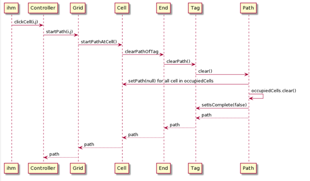

# Numberlink
This project was  the Object Oriented Software Engineering course of CentraleSupélec. The aim was to create a puzzle game with a particular emphasis on code quality : SOLID principles and Demeter's laws
To run the game, clone this repository and run the file ControllerTest.java. From this file, you can easily change the grid to solve (the locations of the endpoints of the paths).

## Diagrams
Designed using UML, to follow SOLID principles. 

One of the sequence conceived diagrams.

